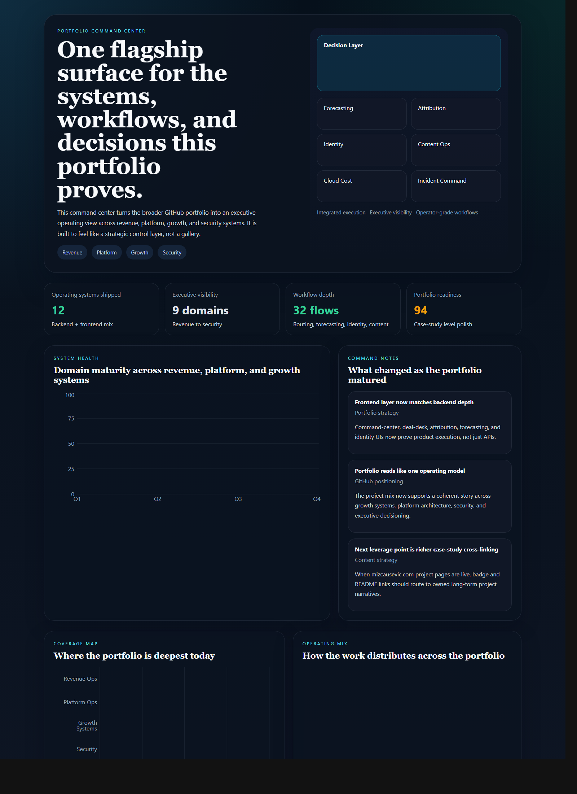
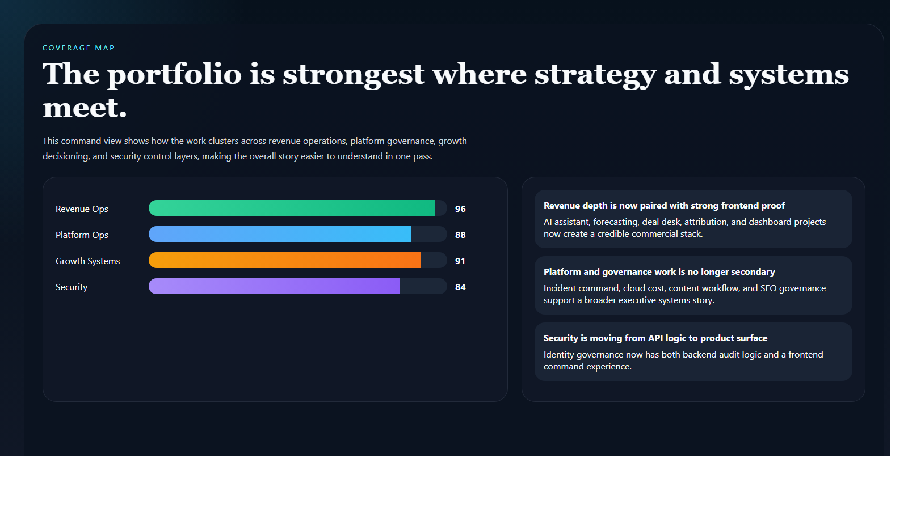
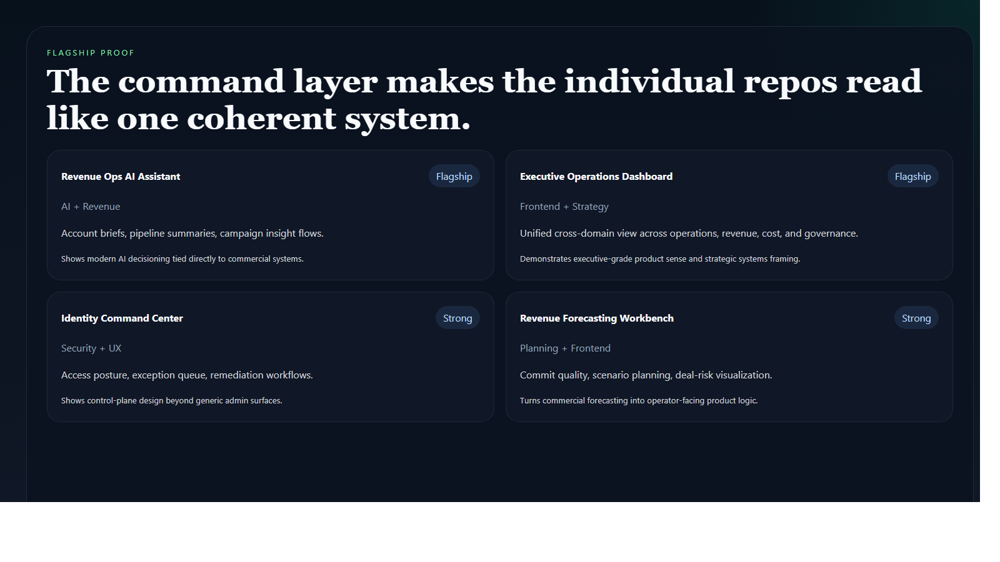
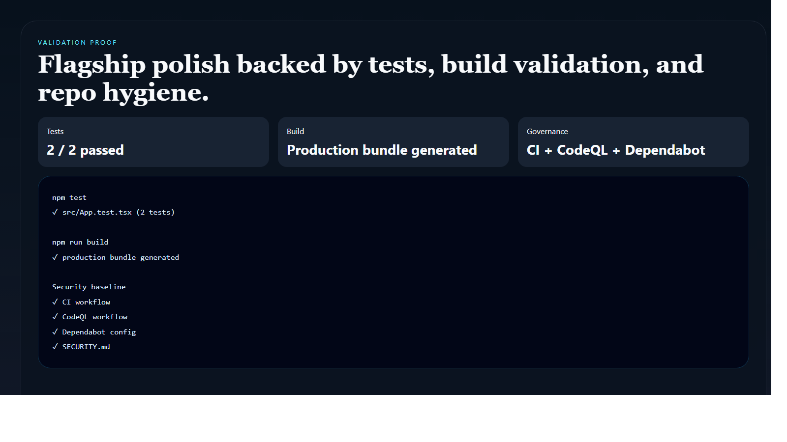

# Portfolio Command Center

> **React + TypeScript flagship portfolio project** demonstrating cross-domain systems design, executive operations framing, and frontend product execution that unifies the broader GitHub portfolio.

**Recruiter takeaway:** *"This person is not shipping isolated demos. They are designing an operating system across revenue, platform, growth, and security."*

---

## Project Overview

| Attribute | Detail |
|---|---|
| **Frontend Stack** | React 19 + Vite + TypeScript |
| **Domain** | Executive operations, portfolio systems orchestration |
| **Audience** | Hiring managers, consulting buyers, executive stakeholders |
| **Signal Areas** | Revenue systems · platform governance · growth workflows · security controls |
| **Portfolio Role** | Flagship frontend that ties the broader repo ecosystem together |
| **Validation** | Vitest + Testing Library |

---

## Executive Summary

Portfolio Command Center is a flagship frontend project built to unify the broader GitHub portfolio into one coherent command surface. Instead of leaving each repository to speak alone, it frames the full body of work as one decision system across revenue, platform, growth, and security operations.

It is designed to make the portfolio feel less like a set of artifacts and more like an executive operating model.

---

## Business Problem

Strong portfolios often lose force because each project is isolated. Hiring managers can see the code, but they cannot always see the system behind it. There needs to be a surface that explains how the projects connect, where the depth is strongest, and why the whole body of work matters together.

---

## Solution

This command center turns the portfolio into a coordinated frontend surface for:

- cross-domain maturity visibility
- flagship project positioning
- operating-model storytelling
- executive-grade systems framing
- premium portfolio UX

---

## Architecture

```text
Portfolio signals and flagship project data
    |
    v
Static TypeScript data model
    |
    v
React application shell
    |
    +--> command-layer hero
    +--> system maturity charts
    +--> operating mix view
    +--> flagship project proof grid
    +--> strategic command notes
```

### Workspace Flow

1. The viewer lands on a single command-layer framing of the portfolio.
2. Signal cards quantify scope, readiness, and domain breadth.
3. Health and coverage charts show where the portfolio is deepest.
4. Flagship project cards connect individual repos to the broader operating model.
5. Command notes explain how the portfolio has matured strategically.

---

## Screenshots

### Hero Capture



### System Coverage View



### Flagship Proof View



### Validation Proof



---

## Key Design Decisions

| Decision | Rationale |
|---|---|
| **Command-center framing** | Makes the repo feel like a master control surface, not a generic portfolio landing page |
| **Portfolio-as-system narrative** | Reinforces that the projects are related operating components |
| **Selective charting** | Keeps the page strategic and legible rather than overloaded |
| **Cool executive visual language** | Gives this repo a distinct flagship identity |
| **Proof-card structure** | Lets the strongest repos carry the story clearly and quickly |

---

## What An Engineering Leader Sees Here

- strong frontend execution tied to strategic systems thinking
- a coherent operating narrative across very different technical domains
- product design judgment at the portfolio level, not just the feature level
- ability to present complex technical depth in an executive-readable way

---

## Getting Started

### Prerequisites

- Node.js 20+
- npm

### Setup

```bash
git clone https://github.com/mizcausevic-dev/portfolio-command-center.git
cd portfolio-command-center
npm install
cp .env.example .env
npm run dev
```

Open:

- `http://localhost:5173`

### Run Tests

```bash
npm test
```

### Build

```bash
npm run build
```

---

## What This Demonstrates

- flagship frontend design for strategic portfolio positioning
- executive-oriented systems communication
- cross-domain information hierarchy and charting choices
- React + TypeScript implementation with tests and production-minded repo hygiene
- product thinking that operates above any single feature or workflow

---

## Future Enhancements

- live case-study deep links to owned site content
- animated transitions between domain views
- repo status sync across GitHub APIs
- richer drilldowns by project family
- personalized versions for hiring, consulting, or speaking contexts

---

## Tech Stack

[](https://react.dev/)
[](https://vite.dev/)
[](https://www.typescriptlang.org/)
[](https://recharts.org/)
[](https://vitest.dev/)
[](https://opensource.org/license/mit)

### Portfolio Links

- [LinkedIn](https://www.linkedin.com/in/mirzacausevic)
- [Skills Page](https://mizcausevic.com/skills/)
- [Medium](https://medium.com/@mizcausevic)
- [GitHub](https://github.com/mizcausevic-dev)

---

*Part of [mizcausevic-dev's GitHub portfolio](https://github.com/mizcausevic-dev) — demonstrating strategic systems design, executive-grade frontend execution, and integrated portfolio storytelling.*
