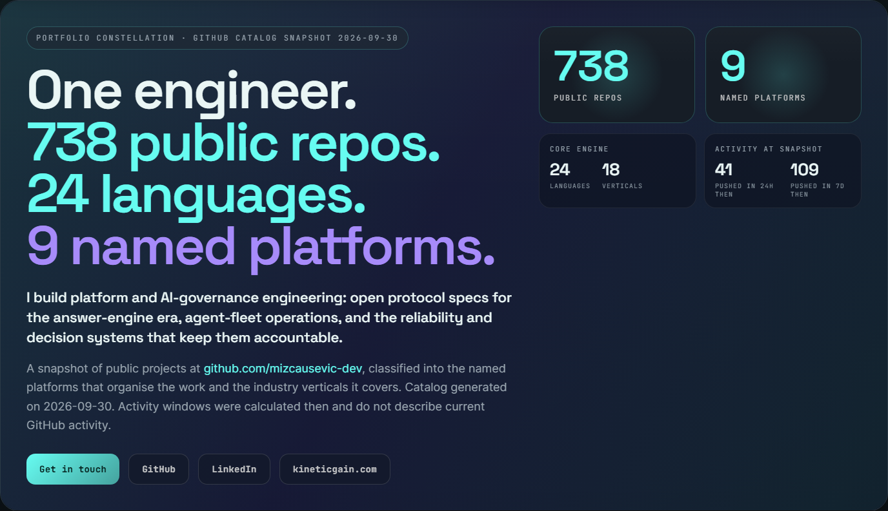
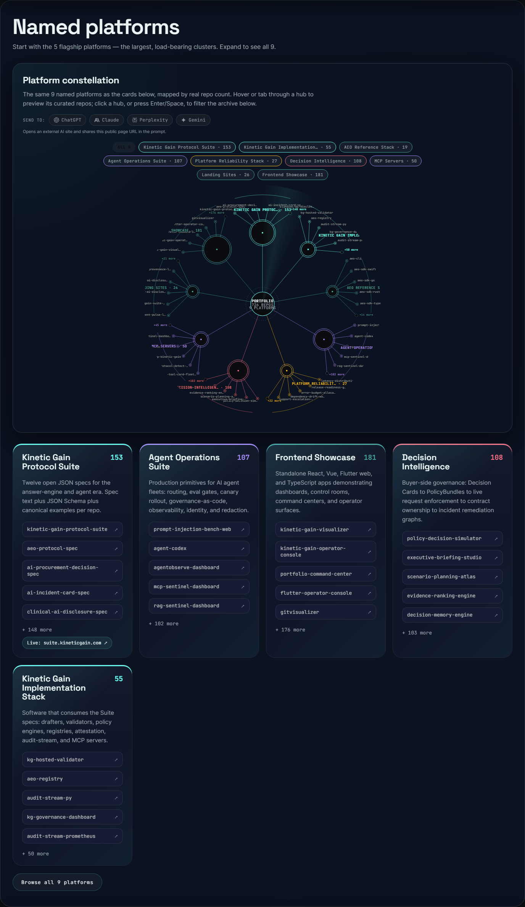
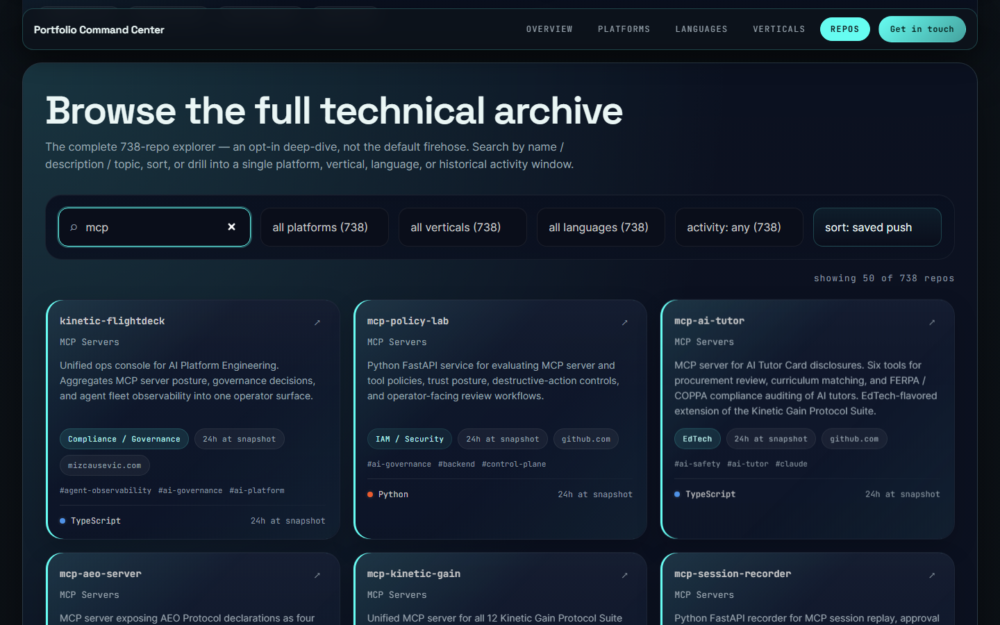
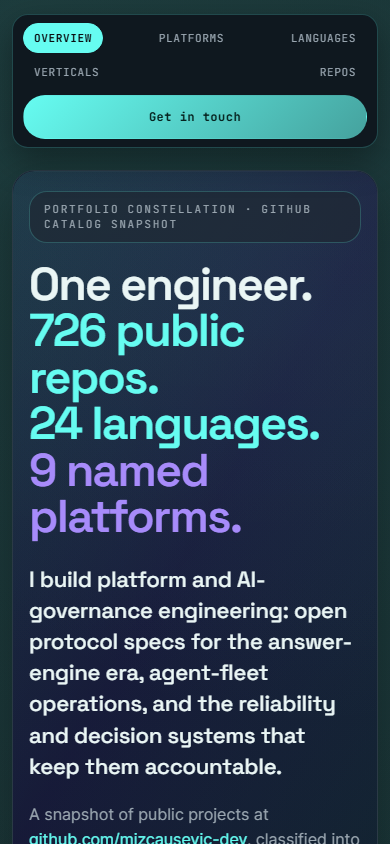

# Portfolio Command Center

> **React + TypeScript flagship portfolio project** demonstrating cross-domain systems design, executive operations framing, and frontend product execution that unifies the broader GitHub portfolio.

**Recruiter takeaway:** *"This person is not shipping isolated demos. They are designing an operating system across revenue, platform, growth, and security."*

---

## Project Overview

| Attribute | Detail |
|---|---|
| **Frontend Stack** | React 19 + Vite + TypeScript |
| **Domain** | Executive operations, portfolio systems orchestration |
| **Audience** | Hiring managers, consulting buyers, executive stakeholders |
| **Signal Areas** | Language atlas · industry atlas · platform/company signals · revenue systems · platform governance · security controls |
| **Portfolio Role** | Flagship frontend that ties the broader repo ecosystem together |
| **Validation** | Vitest + Testing Library |

---

## Executive Summary

Portfolio Command Center is a flagship frontend project built to unify the broader GitHub portfolio into one coherent command surface. Instead of leaving each repository to speak alone, it frames the full body of work as one decision system across revenue, platform, growth, security operations, languages, industry verticals, and recognizable platform/company signals.

It is designed to make the portfolio feel less like a set of artifacts and more like an executive operating model.

---

## Business Problem

Strong portfolios often lose force because each project is isolated. Hiring managers can see the code, but they cannot always see the system behind it. There needs to be a surface that explains how the projects connect, where the depth is strongest, and why the whole body of work matters together.

---

## Solution

This command center turns the portfolio into a coordinated frontend surface for:

- cross-domain maturity visibility
- language and industry atlas exploration
- platform and company signal filtering
- flagship project positioning
- operating-model storytelling
- executive-grade systems framing
- premium portfolio UX

---

## Architecture

```text
Portfolio signals and flagship project data
    |
    v
Static TypeScript data model
    |
    v
React application shell
    |
    +--> command-layer hero
    +--> named platform cards
    +--> language atlas
    +--> industry atlas
    +--> platform and company signal chips
    +--> filterable repo grid
    +--> strategic command notes
```

### Workspace Flow

1. The viewer lands on a single command-layer framing of the portfolio.
2. Signal cards quantify scope, readiness, and domain breadth.
3. Language and industry atlas panels show where the portfolio is deepest.
4. Platform and company signal chips expose recognizable buyer/search terms.
5. The repo grid lets viewers drill into a platform, vertical, language, freshness window, or signal.

---

## Screenshots

These captures come from the local reviewed build. The repository data is a checked-in GitHub catalog generated by `npm run sync:catalog`; the page does not query GitHub live. The displayed snapshot date is recorded in `src/catalogSnapshot.json`. The sync excludes archived repositories. Counts, repo descriptions, and activity windows reflect that dated public GitHub snapshot until it is regenerated; links and descriptions are not independent deployment or quality verification.

### Current hero



### Platform constellation



### Searchable repository explorer



### Phone layout



---

## Key Design Decisions

| Decision | Rationale |
|---|---|
| **Command-center framing** | Makes the repo feel like a master control surface, not a generic portfolio landing page |
| **Portfolio-as-system narrative** | Reinforces that the projects are related operating components |
| **Selective charting** | Keeps the page strategic and legible rather than overloaded |
| **Cool executive visual language** | Gives this repo a distinct flagship identity |
| **Proof-card structure** | Lets the strongest repos carry the story clearly and quickly |

---

## What An Engineering Leader Sees Here

- strong frontend execution tied to strategic systems thinking
- a coherent operating narrative across very different technical domains
- product design judgment at the portfolio level, not just the feature level
- ability to present complex technical depth in an executive-readable way

---

## Getting Started

### Prerequisites

- Node.js 20+
- npm

### Setup

```bash
git clone https://github.com/mizcausevic-dev/portfolio-command-center.git
cd portfolio-command-center
npm install
cp .env.example .env
npm run dev
```

Open:

- `http://localhost:5173`

### Run Tests

```bash
npm test
```

### Build

```bash
npm run build
```

`npm run build` targets the canonical Hostinger root URL. `npm run build:pages` targets the repository path at `https://mizcausevic-dev.github.io/portfolio-command-center/`.

### GitHub Pages release gate

The Pages workflow requires **Settings → Pages → Build and deployment → Source: GitHub Actions**. The legacy `main`/`/` source serves raw Vite source files. The workflow checks this setting before attempting deployment and does not change it automatically. After an authorized merge and source change, run the `pages` workflow and verify that its URL serves compiled `/portfolio-command-center/assets/` files with no `%KG_*%` tokens or `/src/main.tsx` reference. The `public/CNAME` file is ignored when Pages uses a custom Actions workflow; `portfolio.kineticgain.com` remains the canonical Hostinger URL.

### Hostinger release and rollback

A `main` push also runs `hostinger-deploy.yml` for the canonical Hostinger site. It builds and tests the app, uploads over SSH to a staging directory, then moves the previous and new `portfolio` directories into place. SSH failure stops the release; there is no FTP fallback. The previous directory is retained as `.portfolio-backup-<release SHA>`. The workflow writes a public `release.json` containing only the commit SHA and checks that the live HTML SHA-256, built JS path, and marker match the intended artifact, using a cache-busting URL. If live verification fails, it restores the prior directory and keeps the failed release in a separate directory.

An authorized repository operator can run **Actions → Deploy to Hostinger → Run workflow**, choose `rollback`, and enter the full 40-character SHA of the *currently deployed* release. This only works when its matching backup exists and the live `release.json` matches that SHA. The rollback checks the old HTML at the live URL and retains the displaced newer directory. After a planned rollback drill, choose `deploy` on `main` to put the reviewed version back; verify the live marker and Pages URL again. The same workflow will attempt to undo a rollback whose live verification fails. A runner termination or host outage can still interrupt automatic recovery, so inspect the workflow result and live URL before considering the release complete.

To refresh the checked-in catalog, run `npm run sync:catalog`, inspect the generated diff and `src/catalogSnapshot.json`, then recapture screenshots and rerun tests and both builds. A fresh snapshot changes the saved activity windows even when a repository's metadata is otherwise unchanged.

---

## What This Demonstrates

- flagship frontend design for strategic portfolio positioning
- executive-oriented systems communication
- cross-domain information hierarchy and charting choices
- React + TypeScript implementation with tests and production-minded repo hygiene
- product thinking that operates above any single feature or workflow

---

## Future Enhancements

- live case-study deep links to owned site content
- animated transitions between domain views
- repo status sync across GitHub APIs
- richer drilldowns by project family
- personalized versions for hiring, consulting, or speaking contexts

---

## Tech Stack

[](https://react.dev/)
[](https://vite.dev/)
[](https://www.typescriptlang.org/)
[](https://recharts.org/)
[](https://vitest.dev/)
[](https://opensource.org/license/mit)

### Portfolio Links

- [LinkedIn](https://www.linkedin.com/in/mirzacausevic)
- [Skills Page](https://mizcausevic.com/skills/)
- [Medium](https://medium.com/@mizcausevic)
- [GitHub](https://github.com/mizcausevic-dev)

---

*Part of [mizcausevic-dev's GitHub portfolio](https://github.com/mizcausevic-dev) — demonstrating strategic systems design, executive-grade frontend execution, and integrated portfolio storytelling.*
